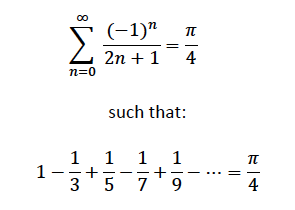

# Cumputing π

## Chudnovsky algorithm
The Chudnovsky algorithm is a fast method for calculating the digits of π (pi). It’s based on Ramanujan’s π formulae and was published by the Chudnovsky brothers in 1988. Here’s how it works:

**Algorithm Overview:**
The Chudnovsky algorithm leverages the negated Heegner number, the j-function, and a rapidly convergent generalized hypergeometric series.

**Binary Splitting Optimization:**
To compute π efficiently, the algorithm uses binary splitting.
A factor of 12 can be taken out of the sum, and the series is simplified.
The time complexity of the algorithm is O(n).

**Recursive Computation:**
The algorithm recursively computes the functions Pab, Qab, and Rab.
The base case for recursion is when b = a + 1.

**Conclusion :**
Increasing the number of digits, the accuracy of the result value would change and the digits before the increased digits also change.
So this method didn't pass the tests.

## Leibniz’s formula

Leibniz’s formula for π is a fascinating mathematical expression. Let’s dive into it:
The formula states that:  

 In other words, the alternating series converges to one-fourth of π. Each term alternates between addition and subtraction, with the denominators following the pattern 1, 3, 5, 7, 9, and so on.
This formula was named after the German mathematician and philosopher Gottfried Wilhelm Leibniz. Interestingly, it was independently discovered by the Indian mathematician Madhava of Sangamagrama (or his followers) in the 14th–15th century. James Gregory also rediscovered it in 1671.
While Leibniz’s formula converges very slowly (requiring a large number of terms for low precision), it can be used to calculate π to high precision using convergence acceleration techniques. For example, the Shanks transformation, Euler transform, or Van Wijngaarden transformation can be applied effectively to the partial sums of the Leibniz series.
 This method didn't pass the tests also.

## Bailey-Borwein-Plouffe Formula (BBP)

The Bailey-Borwein-Plouffe (BBP) formula is a remarkable algorithm for computing the hexadecimal digits of π (pi), starting at the nth digit, without first computing preceding digits! Such algorithms are known as **spigot algorithms**. The BBP formula was discovered experimentally in 1995 via the PSLQ algorithm, which itself was named one of the Top Ten Algorithms of the Century.

The formula can be expressed as:

The remarkable aspect is that it allows you to compute π to arbitrary precision (in hexadecimal) without needing to compute all the preceding digits. However, there are some important considerations:

1. **Computation Time:**
   As you start at later digits, the computation time increases. The time complexity is approximately O(n log n) as a function of the starting digit.

2. **Conversion to Decimal:**
   The hexadecimal digits obtained cannot be directly converted to decimal without first computing all the leading digits.

3. **Memory Consumption:**
   The formula enables you to compute deep into π with minimal memory consumption, using nothing more than basic double precision data types.

I implemented this algorithm with thread pool and 5 threads.
While implementing this algorithm i found that i should round down the final value to pass all the tests. 